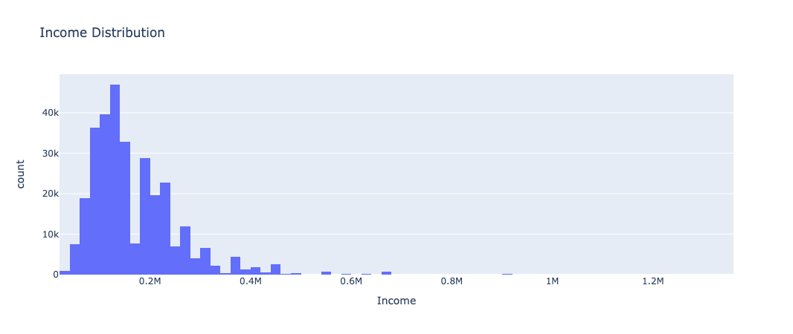
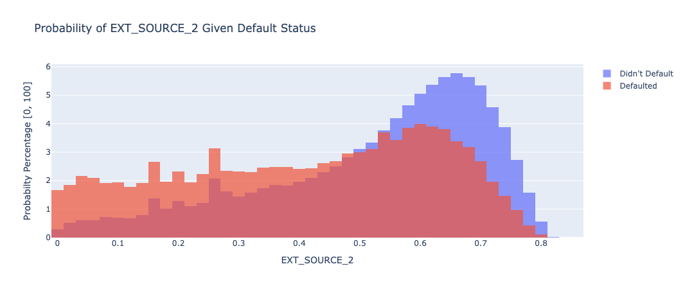
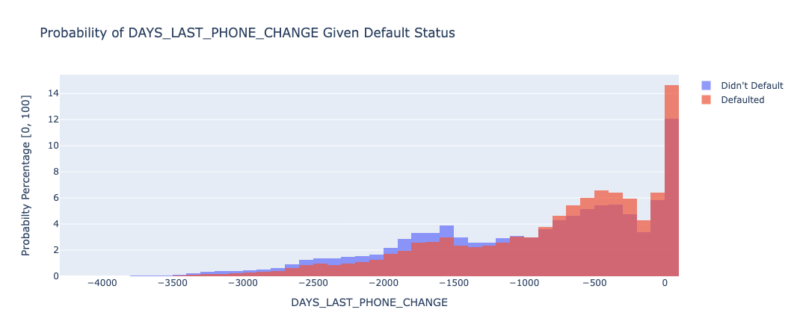
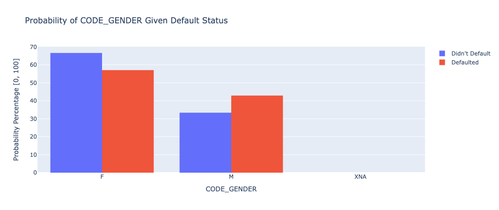
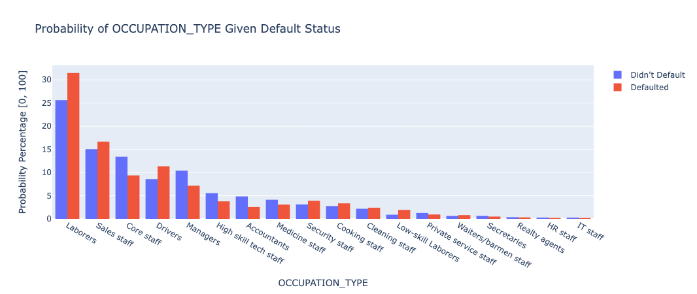
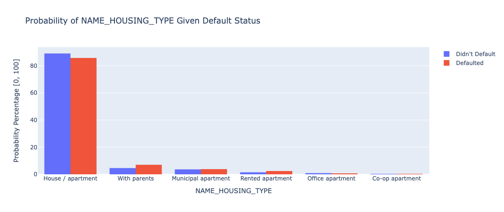
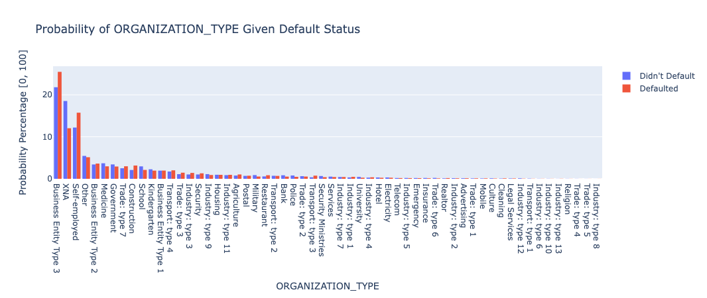

# Video Presentation 

# Introduction / Background
Banks and financial institutions act as money lenders and provide loans, as well as credit lines for millions of customers worldwide. However, for them to operate in a profitable manner and reduce the risk of their customers defaulting on payments for loans, they have to be able to accurately assess an individual's potential to default on their credit (in general, their overall credibility). This is also highly beneficial for them to determine the amount of interest that they should be charging on a given loan, and overall, whether they should offer the loan in the first place. This project is based around building a binary classification model that can be used to predict whether a borrower will default on their loan (meaning that they are unable to pay back a loan provided by a financial institution). A review of relevant literature showed us that privately securitized adjustable-rate mortgages have much more variance in performance when compared to retained mortgages, underscoring the importance of providing financial institutions with the best tools to aid decision making processes [(Krainer & Laderman, 2013)](https://doi.org/10.1007/s10693-013-0161-7‌). Delving into the literature revolving around this topic also greatly helped influence decisions made for this report, which will be elaborated on further in later sections.

For this project, our team opted to use the dataset provided by the Home Credit Group from a Kaggle competition. This data set has over 100 features about loan applicants and their credit risk. The dataset can be found at [this link](https://www.kaggle.com/c/home-credit-default-risk/data). In later sections, we discuss how we processed, cleaned, and reduced the data set to create a binary classification model to determine if applicants will default or not.

# Problem Definition
In today's volatile housing market, numerous potential borrowers face challenges in securing loans, often hindered by limited or absent credit histories. This situation breeds opportunities for unscrupulous lenders to exploit such individuals, while traditional banks miss out on viable clients due to irregular assessment methods. Emphasizing the crucial need for accurate predictions of loan repayment, it's imperative to ensure that qualified borrowers aren't unjustly denied. Equally vital is the early identification of likely defaulters to avert financial losses. Relying solely on manual risk assessment is not only time-consuming but also subject to human biases and inconsistency. Therefore, the development of a model to categorize individuals based on their repayment risk is essential. Such a model can help financial institutions streamline the evaluation process, enhance consistency in risk assessment, and significantly lower the incidence of loan defaults.

# Data Collection
Our initial dataset for training the binary classification model, aimed at predicting home credit loan defaults, was extensive, comprising 122 features (columns) and over 300,000 instances (rows). This also primarily came from a singular file, `application_train.csv`. For this portion of the project, we focused on the features present in that file, and for the final portion of the project, we hope to integrate and use features from other files present in the dataset, as they also contain relevant data as well (we opted to prioritize processing the data in this file due to time constraints). Recognizing the need for dimensionality reduction, after downloading and reading through the dataset and relevant descriptions, we had to clean up the data to prepare it for classification by our models. We completed the following steps, described below, to clean our data set:

1. **Data Cleaning and Feature Selection**: We initiated our process by identifying features with substantial missing data, specifically those with over 50% missing values. This criterion led to the elimination of several columns, primarily consisting of incomplete data or binary flags, which were impractical for meaningful imputation. This decision aligns with practices recommended in [Bao et al. (2019)](https://doi.org/10.1016/j.eswa.2019.02.033) and [de Castro Vieira et al. (2019)](https://doi.org/10.1016/j.asoc.2019.105640), who both recommend against the use of substantial missing data, as filling in missing values can lead to data distortion, and that many missing data points can harm accuracy. Bao et al. specifically stated that their cleaning approach started with: "for the features not filled out by 95% of applicants or above, we removed this feature." These papers, along with other sources from our initial literature review and background research, underscore the importance of data quality and relevance in predictive accuracy.

    ```python
    def defaultClean(df: pd.DataFrame) -> None:
        # ignore_columns: a list of columns that were deemed irrelevant
        df.drop(ignore_columns, axis=1, inplace=True)
    ```

2. **Validation of Feature Removal**: To validate our feature removal decisions, we utilized a Decision Tree Classifier. We opted to utilize this approach based on information supported by [Emad Azhar Ali et al. (2021)](https://doi.org/10.24867/ijiem-2021-1-272). This helped us confirm that the eliminated features had minimal impact on predicting loan defaults, ensuring the retained data's relevance and quality, while also highlighting features that might have significant relevance towards predicting an individual defaulting on a home loan. 

    ```python
    from sklearn.tree import DecisionTreeClassifier
    import matplotlib.pyplot as plt
    import pandas as pd

    def get_feature_imp(X_train, y_train):
        tree = DecisionTreeClassifier()
        tree.fit(X_train, y_train)
        importances = tree.feature_importances_
        feat_importances = pd.DataFrame(importances, index=X_train.columns, columns=["Importance"])
        feat_importances.sort_values(by='Importance', ascending=False, inplace=True)
        feat_importances.plot(kind='barh', figsize=(80,60))
    ```

    The above code generated the following plot, which can be viewed separately (with zoom capabilities) [by clicking here](resources/midterm/decision-tree-results.png "download"): 
    

3. **Handling Categorical Data**: We then addressed the challenge of categorical data, transforming string or object data types into discrete numerical codes. This conversion is crucial for compatibility with machine learning algorithms, as noted in [Krainer and Laderman (2013)](https://doi.org/10.1007/s10693-013-0161-7‌). We utilized `pandas` for this approach, and a snippet of the code achieving this is shown below:

    ```python
    str_columns = df.select_dtypes(['string', "object"]).columns
    df[str_columns] = df[str_columns].astype("category")
    cat_columns = df.select_dtypes(['category']).columns
    df[cat_columns] = df[cat_columns].apply(lambda x: x.cat.codes + 1)
    ```

4. **Imputation of Missing Values**: For the remaining features, our strategy for handling missing values varied based on the feature context. For instance, null values in 'OWN_CAR_AGE' were interpreted as the absence of a car and replaced with zeros. This approach of context-sensitive imputation is supported by [Bao et al. (2019)](https://doi.org/10.1016/j.eswa.2019.02.033), emphasizing the importance of maintaining data integrity.

5. **Advanced Imputation Techniques**: For features where zero imputation was inappropriate, we initially applied `sklearn`’s SimpleImputer with -1 as a placeholder. Recognizing the limitations of this naive approach, we plan to explore more sophisticated methods, such as the K-Nearest Neighbors (KNN) imputer. However, our trial with KNN imputation proved time-consuming (the runtime was taking far too long, eliminating it from consideration). That being said, its potential for more accurate imputation, as suggested by [de Castro Vieira et al. (2019)](https://doi.org/10.1016/j.asoc.2019.105640), warrants future consideration in the final portion of the project.

6. **Dimensionality Reduction with PCA and Data Normalization**: Prior to applying Principal Component Analysis (PCA), we utilized the RobustScaler for data normalization. The RobustScaler is particularly effective in datasets with outliers, as it scales features using statistics that are robust to outliers. This scaler subtracts the median and scales the data according to the Interquartile Range (IQR). In the context of credit data, where outliers can significantly skew the data distribution, this method ensures that our PCA is not influenced unduly by extreme values. This scaling approach, therefore, enhances the effectiveness of PCA, which we applied to reduce our feature set to 40 principal components. By choosing 40 components, we captured approximately 95% of the variance in the dataset, striking an optimal balance between dimensionality reduction and information retention, as recommended by [Emad Azhar Ali et al. (2021)](https://doi.org/10.24867/ijiem-2021-1-272). This balance is crucial in machine learning, as it preserves essential data characteristics while reducing computational complexity. Finally, we divided our dataset using an 80/20 training-test spli using `sklearn`, following a standard practice for evaluating model performance in machine learning.

    ```python
    def run_pca(df: pd.DataFrame, n_components: float) -> pd.DataFrame:
        # Standardize the data
        X_std = RobustScaler().fit_transform(df)

        # running PCA
        pca = PCA(n_components=n_components)
        principal_components = pca.fit_transform(X_std)
        principal_df = pd.DataFrame(data=principal_components, columns = [f'Component {x}' for x in range(1, principal_components.shape[1] + 1)])

        return principal_df
    ```

This comprehensive data preparation process ensures a robust, relevant, and efficient dataset, ready for deploying in our binary classification model to predict home credit loan defaults.

# Data Visualizations
To help us understand the dataset better, we plotted many features using `pandas` and `plotly`. First, we wanted to determine the balance of our dataset for the binary classification, so we examined the number of non-defaults, 0, and the number of defaults, 1.


This chart shows that the dataset is heavily skewed in favor of people who didn't default on their loans, which is representative of the real world. That implies that high accuracy results aren't necessarily a sign of a working algorithm, and that we would need to use other metrics to make sure our models work properly.

--- 

We then wanted to examine the income distribution of the individuals who were represented in the data set. 



This chart just shows the income distribution of our dataset, without some heavy outliers with an absolute z-score of 5 or higher. The distribution matches up with a generic population distribution of incomes, which shows that our dataset is a good representation of larger populations.

The following charts are overlayed histograms which divide the data by default status, with the orange being those who did default and the blue representing those who didn't default. All of the charts are normalized around the likelihood of any datapoint landing in a certain bin given a person's default status, as just measuring the total count isn't very useful since so many more people didn't default than those who did. The dataset also included credit ratings and history from other external sources (**EXT_SOURCE_1, EXT_SOURCE_2, EXT_SOURCE_3**), and we knew that we wanted to explore these features more to understand their impact on classifier results:





**EXT_SOURCE_1**: This chart shows that the EXT_SOURCE_1 metric predicts a higher value for those who are less likely to default, and does a fairly good job of splitting the data, although it's a very gradual split.

**EXT_SOURCE_2**: This chart shows that the EXT_SOURCE_2 metric predicts a higher value for those who are less likely to default, and can predict the likelihood of not defaulting pretty well, though it has a more uniform distribution for those who did end up defaulting.

**EXT_SOURCE_3**: EXT_SOURCE_3 also predicts a higher value for those who are less likely to default, and follows a similar distribution to EXT_SOURCE_1, with a higher emphasis on those who didn't default.

--- 

Aside from external sources, we also found some metrics that have relationships with default status. These plots are shown below:


The amount of days since your birth seems to directly relate to a person's default status. The more days since you were born (the older you are), the less likely it seems you are to default.



--- 

Finally, we examined some demographics and and general information regarding each of the individuals included in the data set. Some significant or interesting plots of the data are shown below: 



The graph shows that there are more people who identified as female in the dataset, and overall, males were more likely to default on their loans.



Overall, people with occupations which usually pay more seemed to default significantly less. Those occupations include: core staff, managers, high skill tech staff, accountants, medicine staff, and private service staff. The rest of the occupations were either about even or had higher proportions of people who defaulted.


Similar to occupation, people with a higher level of education ended up comprising a smaller portion of those who defaulted on their loans.



Those who live in their own housing comprise a relatively smaller proportion of those who defaulted than those who didn't, while almost every other housing type did the opposite.



This dataset is harder to analyze as there are a lot of categories that divide the data, but it also displays the different organizations people are in and what percentage of those who defaulted and those who didn't came from each type of organization.

Overall, these visualizations helped our group understand the data set better, give us insights into important features, and how to best prepare them for classification.

# Methods

# Results and Discussion 

# Team Contributions

## Contribution Table

## Project Timeline and Gantt Chart

---

# References

1. Bao, W., Lianju, N., & Yue, K. (2019). Integration of unsupervised and supervised machine learning algorithms for credit risk assessment. Expert Systems with Applications, 128, 301–315. https://doi.org/10.1016/j.eswa.2019.02.033
2. de Castro Vieira, J. R., Barboza, F., Sobreiro, V. A., & Kimura, H. (2019). Machine learning models for credit analysis improvements: Predicting low-income families’ default. Applied Soft Computing, 83, 105640. https://doi.org/10.1016/j.asoc.2019.105640
3. Emad Azhar Ali, S., Sajjad Hussain Rizvi, S., Lai, F.-W., Faizan Ali, R., & Ali Jan, A. (2021). Predicting Delinquency on Mortgage Loans: An Exhaustive Parametric Comparison of Machine Learning Techniques. Vol12 - Issue 1, Volume 12(Issue 1), 1–13. https://doi.org/10.24867/ijiem-2021-1-272
4. Krainer, J., & Laderman, E. (2013). Mortgage Loan Securitization and Relative Loan Performance. Journal of Financial Services Research, 45(1), 39–66. https://doi.org/10.1007/s10693-013-0161-7‌
